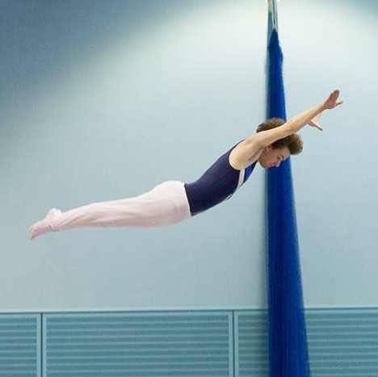

<section style="align-items: center;background: #55b200 url(./assets/am.svg) no-repeat center/contain;border-bottom: 2px solid white;display: flex;height: 128px;justify-content: space-between;position: relative;width: 100%;">
    <figure>
        
    </figure>
    <figure>
        
    </figure>
</section>

<h1 style="margin: 0 auto;position: relative;text-align: center;width: fit-content;">Alasdair Macrae</h1>
 

    React
    NextJS
    Storybook
    CSS

The unparalleled blend of front-end web developer and trampolinist.

I am passionate about building exciting whilst performant web experiences and pushing the limits of what CSS can do!

<ul>
    <li>Games industry web engineer with over 13 years developer experience</li>
    <li>Launched and maintain multiple websites for AAA titles</li>
    <li>Avid Design System author via Storybook</li>
</ul>